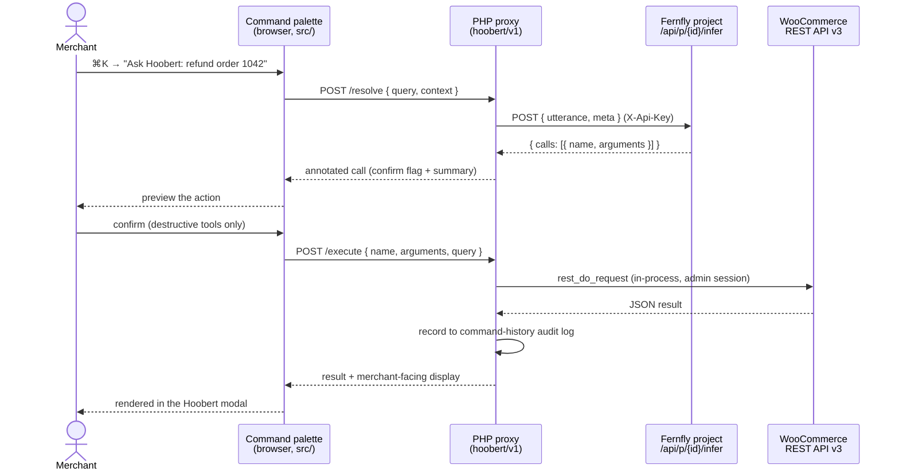

# Hoobert

An agentic **command bar for WooCommerce merchants**, built into WordPress's native `⌘K` command palette. Press `⌘K` / `Ctrl-K` anywhere in wp-admin, pick **Ask Hoobert** and type what you want in plain English, like *"refund order 1042"*, *"add a Large/Red variation to this product at 54.99"*, or *"who are my top customers this month"*, and Hoobert turns it into the right WooCommerce REST API v3 action and runs it.

Hoobert is powered by **Fern**, a family of small language models from [Fernfly](https://fernfly.com). A tiny specialized model drives a complex admin surface faster than clicking through menus.

The browser never holds the inference key or WooCommerce credentials. A PHP proxy holds the inference key and executes REST calls in-process via `rest_do_request` under the current admin's capabilities. Destructive tools (refunds, deletes, status changes) are flagged `x-woo.confirm` and require a confirm click. Every executed command is written to a store-wide audit log.

## Contents

- [Architecture](#architecture)
- [Dev setup](#dev-setup)
- [Getting credentials from Fernfly](#getting-credentials-from-fernfly)
- [Adding new tools](#adding-new-tools)
- [Layout](#layout)
- [The tool set](#the-tool-set)
- [Publishing](#publishing)
- [About](#about)

## Architecture

Hoobert is a WordPress plugin, not a WooCommerce React (SPA) extension. The front-end is a thin command-palette client; all inference and REST execution happen server-side through the plugin's own admin-only routes (`hoobert/v1`). Splitting **resolve** from **execute** lets the UI preview the chosen action, and confirm destructive ones, before anything runs.



Key decisions and why:

- **REST API v3, not the Store API.** The journeys (refunds, create product, order notes, top customers, coupons) are merchant/admin operations that live in `wc/v3`; the customer-facing Store API can't do them. The model is trained on REST v3 tool schemas.
- **Server-side execution.** The PHP proxy holds the inference key and runs tool calls in-process under the admin's own capabilities, so no API keys touch the browser.
- **Resolve, then execute, with confirmation.** `/resolve` returns the chosen tool call without running it; the UI previews it and, for tools flagged `x-woo.confirm`, requires a confirm click before `/execute` runs it.

The proxy exposes three routes, all gated on `manage_woocommerce`:

| Route                 | Method | Purpose                                                                                              |
| --------------------- | ------ | ---------------------------------------------------------------------------------------------------- |
| `/hoobert/v1/resolve` | POST   | Send `{ query, context }` to the inference endpoint; return the chosen tool call(s), each annotated with its confirm flag and description. No execution. |
| `/hoobert/v1/execute` | POST   | Run one resolved `{ name, arguments }` against WC REST v3 and record it to the audit log.            |
| `/hoobert/v1/history` | GET    | Return the recent command history for the current user.                                              |

## Dev setup

Prerequisites: Docker (for the local WordPress + WooCommerce stack) and Node 22+ (for the front-end bundle).

```bash
cp .env.example .env            # local stack config (DB, admin account, port)

# 1. Build the front-end bundle (needed before the plugin can activate).
cd plugin/hoobert && npm install && npm run build && cd ../..

# 2. Bring up the stack. The wpcli service provisions WordPress + WooCommerce,
#    seeds sample data (idempotent, safe to re-run).
docker compose up -d

# 3. Watch provisioning.
docker compose logs -f wpcli

# 4. Open the store and press ⌘K / Ctrl-K.
open http://localhost:8080/wp-admin
```

If you bring the stack up before building the bundle, the plugin won't activate. Build it, then re-run provisioning with `docker compose run --rm wpcli`.

Then set the inference endpoint URL and API key under **WooCommerce → Hoobert** (see [Getting credentials from Fernfly](#getting-credentials-from-fernfly)). The WooCommerce REST API key/secret for external/curl testing are printed once in the `wpcli` logs.

**Front-end workflow** (run inside `plugin/hoobert`):

```bash
npm run start        # wp-scripts build in watch mode
npm run build        # one-off production bundle
npm run lint:js      # lint src/
npm run format       # format src/
npm run bump -- 0.2.0   # or: patch|minor|major. Bumps the version across
                        # hoobert.php, readme.txt, package.json, blueprint.json
```

Docker images (WordPress, MariaDB, WP-CLI) are pinned in `docker-compose.yml` so every contributor runs the same versions; bump them deliberately alongside the plugin's "Tested up to" header.

**No-install demo.** [`blueprint/`](blueprint/) holds a [WordPress Playground](https://wordpress.github.io/wordpress-playground/) blueprint that spins up a throwaway store in the browser, WooCommerce and Hoobert pre-installed and seeded, no local stack required. See [`blueprint/README.md`](blueprint/README.md).

## Getting credentials from Fernfly

Hoobert needs two values, set on the settings page (**WooCommerce → Hoobert**):

- **Inference endpoint URL** - the full URL of your Fernfly project's infer route, e.g. `https://fernfly.com/api/p/abc-dddddd-xyz/infer`. This is a stable, project-level endpoint that always routes to the project's active deployment.
- **API key** - the project's key, sent as the `X-Api-Key` header on every inference request.

To get them, open your project in [Fernfly](https://fernfly.com) (the platform that fine-tunes and deploys the Fern model behind Hoobert). The project owns the registered WooCommerce tool set and its active deployment; copy its infer URL and API key into the settings page. Until both are set, the command bar returns a "not configured" error.

The plugin sends only `{ utterance, meta }` to this endpoint. It does **not** send a tool list or a model id, because the project owns the tool set. Keep the tool set in the project in sync with [`plugin/hoobert/tools.json`](plugin/hoobert/tools.json) (see below).

## Adding new tools

The shipped tool set lives in [`plugin/hoobert/tools.json`](plugin/hoobert/tools.json): a single object with a metadata header (`name`, `version`, `api`, `context_variables`, `notes`) and a `tools` array. Each entry is a standard OpenAI **function-calling schema** (`type` + `function`) plus a private **`x-woo`** block that the plugin's executor reads to dispatch the call. The `function` half is what the Fern model is trained on; `x-woo` is stripped before the tool set is registered with Fern.

```jsonc
{
  "type": "function",
  "function": {
    "name": "refund_order",
    "description": "Refund an order... Use for 'refund this order', 'refund $20 on order 1042'.",
    "parameters": {
      "type": "object",
      "required": ["id"],
      "properties": {
        "id":     { "type": "integer", "description": "Order id. Falls back to current_order_id." },
        "amount": { "type": "string",  "description": "Decimal string, e.g. '20.00'. Omit for full refund." }
      }
    }
  },
  "x-woo": {
    "method": "POST",                    // HTTP verb for the REST call
    "path": "/orders/{id}/refunds",      // path template; {tokens} are filled from arguments
    "path_params": ["id"],               // which args are path tokens (removed from the body)
    "namespace": "wc/v3",                // optional; defaults to wc/v3 (use wc-analytics for analytics)
    "confirm": true,                     // require a confirm click before executing
    "display": {                         // optional merchant-facing view of the response
      "type": "object",                  // "object" = labeled rows, "list" = a column table
      "title": "Refund issued",          // supports {token} interpolation from the response
      "fields": [
        { "label": "Amount", "path": "amount", "format": "currency" },
        { "label": "Date",   "path": "date_created", "format": "date" }
      ]
    }
  }
}
```

How the executor uses `x-woo` (see [`class-executor.php`](plugin/hoobert/includes/class-executor.php)):

1. Substitute `{token}` path params from the arguments and drop them from the payload.
2. Remaining arguments go to the query string for `GET`, or the JSON body for writes.
3. Run the request in-process with `rest_do_request` under the admin's session.
4. If `display` is set, build a merchant-facing payload from it; otherwise the front-end shows raw JSON.

`display` field options: `path` (a dotted path like `billing.first_name`), `paths` (several paths space-joined), and `format` (one of `currency`, `date`, `status`, `stock`, `bool`, `count`). `context_variables` (`current_order_id`, `current_product_id`) are filled from the current wp-admin screen so "this order/product" resolves to a concrete id.

**To add a tool:**

1. Add the entry to `tools.json` (both the `function` schema and the `x-woo` block).
2. Register the matching `function` object with your Fernfly project and retrain/redeploy so the model can emit it. `tools.json` is the canonical copy on the plugin side; keep the project copy in sync.
3. Rebuild is not needed for tools alone (the executor reads `tools.json` at runtime), but a fresh deploy of the plugin should ship the updated file.

Keep the set focused. It is deliberately capped at ~28 tools covering core journeys; each tool widens the fine-tune surface, so grow it deliberately.

## Layout

| Path                           | What                                                                                                 |
| ------------------------------ | ---------------------------------------------------------------------------------------------------- |
| `plugin/hoobert/`              | The WordPress plugin. Main file `hoobert.php`.                                                       |
| `plugin/hoobert/src/`          | Command-palette front-end (`index.js`, `flow.js`, `history.js`, `api.js`), built with `@wordpress/scripts`. |
| `plugin/hoobert/includes/`     | PHP: `class-rest-proxy` (routes), `class-executor` (dispatch), `class-fern-client` (inference), `class-tools` (tool-set loader), `class-history` (audit log), `class-settings` (settings page). |
| `plugin/hoobert/tools.json`    | The shipped tool set: metadata header + 28 merchant tools, each an OpenAI function schema plus an `x-woo` dispatch block. |
| `blueprint/`                   | WordPress Playground blueprint for a zero-install browser demo.                                      |
| `docker-compose.yml`           | Pinned WordPress + MariaDB + WP-CLI for local dev. The wpcli service auto-provisions the stack.      |
| `scripts/setup.sh`             | Runs in the wpcli container: installs WP + WooCommerce, seeds sample data, mints REST API keys. Idempotent. |
| `scripts/seed-sample-data.php` | Products, a variable product, orders across 90 days and every status, refunds, customers, reviews, coupons, plus a refund-capable sample gateway. Idempotent. Shared by local dev and the blueprint demo. |
| `scripts/generate-api-key.php` | Mints a WooCommerce REST consumer key/secret for external testing.                                   |
| `assets-src/`                  | Sources for the plugin-directory artwork: the owl (`hoobert-owl.svg`) and the banner layout (`banner.html`). |
| `.wordpress-org/`              | Generated directory assets (icons, banners, preview blueprint) plus hand-added screenshots. Copied to SVN `assets/` on release. |
| `docs/wordpress-org-submission.md` | Everything needed to publish to the WordPress.org plugin directory.                              |

## The tool set

28 tools spanning the merchant journeys:

- **Orders** - list, get, update status, refund, add/list notes.
- **Products** - list, get, create, update, update stock, delete.
- **Variations** - list, create.
- **Reviews** - list, moderate.
- **Customers** - list, get, top-by-spend.
- **Coupons** - create, list, update.
- **Taxonomy** - product categories & tags (list/create).
- **Reports** - sales, top sellers (legacy `wc/v3/reports/*`); top customers uses the `wc-analytics` namespace, which requires WooCommerce Analytics enabled (setup does this).

## Publishing

Hoobert is built to ship through the WordPress.org plugin directory.
[`docs/wordpress-org-submission.md`](docs/wordpress-org-submission.md) covers the
guidelines, the compliance checklist, and the submission steps.

Directory artwork is generated from `assets-src/`:

```bash
node scripts/build-wporg-assets.mjs   # icons + banners -> .wordpress-org/
```

Screenshots are added by hand as `.wordpress-org/screenshot-N.png`, matching the
captions in [`readme.txt`](plugin/hoobert/readme.txt). Once the plugin is approved
and `SVN_USERNAME` / `SVN_PASSWORD` are set as repository secrets, the release
workflow publishes each release to wp.org automatically.

## About

Hoobert is a merchant-facing command bar for WooCommerce, packaged as a production WordPress plugin. It is a satellite of the [Fernfly](https://fernfly.com) platform, which fine-tunes and deploys **Fern**, the small function-calling model that maps each merchant utterance to a tool call.

Hoobert is a proof that a tiny, specialized model driving a real, complex admin surface: the plugin ships a fixed tool set, executes REST calls under the admin's own capabilities, confirms anything destructive, and logs every command. No keys in the browser, no SPA, no general-purpose LLM in the loop.

License: GPL-2.0-or-later.

Owl artwork: <a href="https://www.flaticon.com/free-icons/funny-owl" title="funny owl icons">Funny owl icons created by agustrisana - Flaticon</a>.